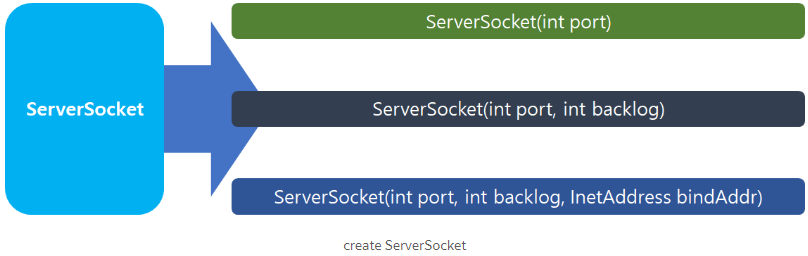

# Multi Room Chatting

## Server Socket

* 서버 프로그램을 구현하는데 사용된다
* 1 - 6 단계로 구현 되며, 목적에 따라 3,4,번을 반복 수행 하여 사용
  1. Server Socket Create, Port Binding
  2. 클라이언트로부터 연결을 기다리고 요청이 오면 수락
     * accept() - 요청이 수락되면 이 함수가 실행이 되고 오지않을경우 대기를 한다
  3. 클라이언트 소켓에서 가져온 InpotStream을 읽음
  4. 응답이 있다면 OutputStream을 통해 클라이언트에 데이터 전달
  5. Client.close();
  6. Server.close();
* ServerSocket Object Create

* (int port)
  * 지정된 포트번호에 바인딩된 서버 소켓을 만듬(연결 대기열 최대 수 50)
* (int port, int Backlog)
  * 지정된 포트 번호에 바인드 된 서버 소켓을 만들고 대기중인 최대 연결 수를 backlog매개 변수로 지정
* (int port, int Backlog, InetAddress bindAddr)
  * 서버 소켓을 만들고 지정된 포트번호와 로컬 IP 주소에 바인딩

